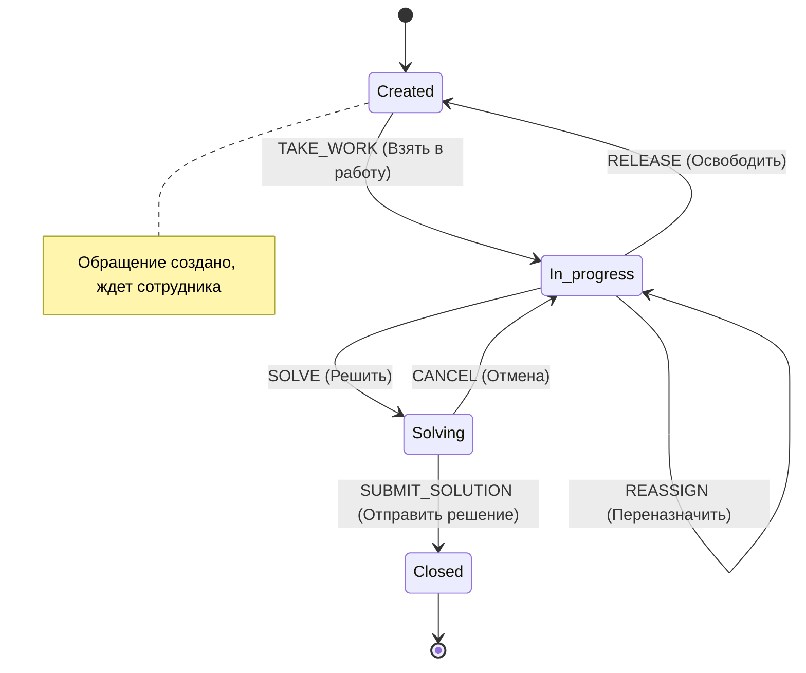
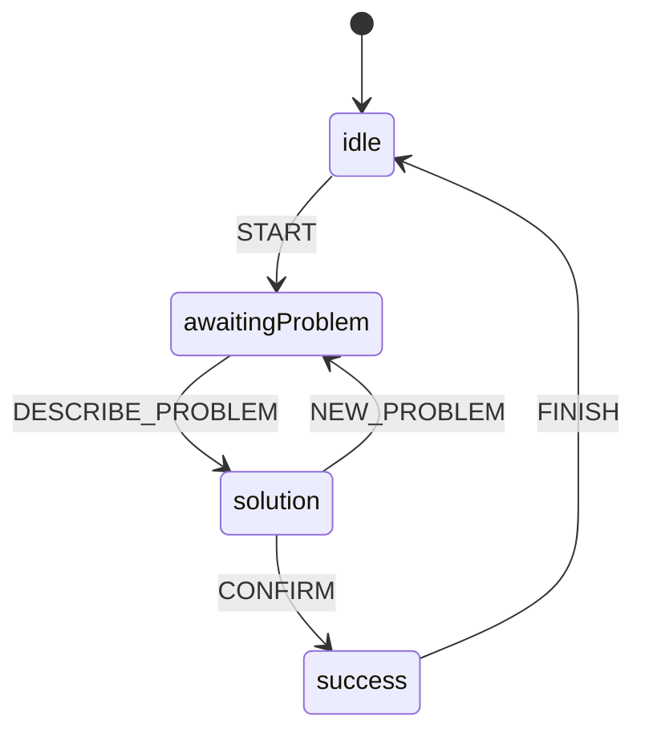
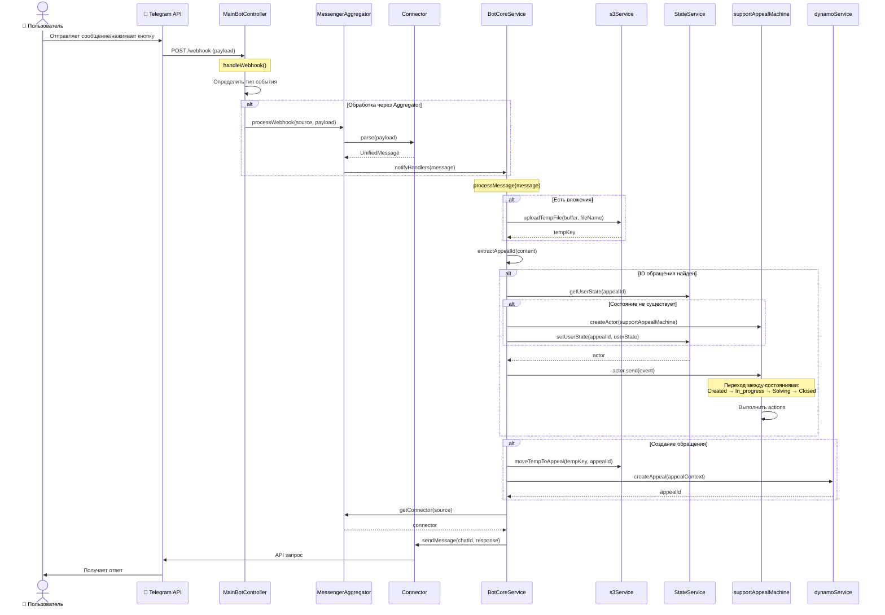

# Support Bot IST

## 📋 Описание проекта

**Support Bot IST** — это модульная система для автоматизации технической поддержки и обработки обращений. Проект построен на архитектуре микросервисов (в рамках монорепозитория) с использованием **Node.js**, **TypeScript**, **Express**, **XState** для управления состояниями, **DynamoDB** для хранения данных и **MinIO (S3)** для хранения файлов.

Система спроектирована так, чтобы быть **платформо-независимой**. Это достигается за счет модуля **Messenger Aggregator**, который приводит сообщения из разных источников (Telegram, WhatsApp и др.) к единому формату (`UnifiedMessage`).

---

## 🏗 Архитектура проекта

### 📂 Структура файлов

```text
src/
├── config/                 # Конфигурация (DynamoDB, env)
├── controllers/            # Контроллеры (обработка HTTP запросов)
│   └── main-bot-controller.ts # Основной контроллер для вебхуков Telegram
├── features/               # Модули функциональности (Auth, User Profile, Health Check)
├── machines/               # Машины состояний (XState)
│   ├── support-appeal-machine.ts # Логика обработки обращения в поддержку
│   └── repair-bot-machine.ts     # Логика бота по ремонту
├── middleware/             # Middleware (Аутентификация, Валидация)
├── modules/
│   └── messenger-aggregator/ # Модуль агрегации мессенджеров
│       ├── connectors/     # Коннекторы для разных платформ (Mock, Telegram)
│       ├── interfaces/     # Интерфейсы (Connector)
│       └── messenger-aggregator.ts # Основной класс агрегатора
├── scripts/                # Скрипты для инициализации и тестов
├── services/               # Бизнес-логика
│   ├── bot-core-service.ts   # Ядро бота (связь агрегатора, машин состояний и БД)
│   ├── s3-service.ts        # Работа с MinIO (S3)
│   ├── dynamo-service.ts    # Работа с DynamoDB
│   └── state-service.ts     # In-memory хранилище состояний пользователей
├── utils/                  # Утилиты
├── app.ts                  # Настройка Express приложения
├── index.ts                # Точка входа (запуск сервера)
└── routes.ts               # Маршрутизация API
```

### 🧠 Дерево состояний (State Machines)

Проект активно использует **XState** для управления логикой диалогов.

#### 1. Root Machine (`main-states.ts`)
Корневая машина, управляющая навигацией пользователя.
- **Welcome**: Приветствие и выбор действия.
- **List Appeals**: Просмотр списка обращений.
- **Create Appeal**: Запуск мастера создания обращения.
- **Join Appeal**: Запуск мастера присоединения к обращению.

#### 2. Support Appeal Machine (`support-appeal-machine.ts`)
Управляет жизненным циклом обращения со стороны поддержки.



#### 3. Master Create Appeal (`master-create-appeal.ts`)
Пошаговый мастер создания обращения (Wizard).
- **Steps**: Описание -> Категория -> ПО -> Критичность -> Вложения -> Подтверждение.

#### 4. Repair Bot Machine (`repair-bot-machine.ts`)
Простой бот для диагностики проблем.



---

## ⚙️ Функционал

### 1. Messenger Aggregator
Позволяет подключать разные мессенджеры через единый интерфейс `Connector`.
- **Вход:** Специфичный payload от мессенджера (например, Telegram Webhook).
- **Процесс:** Коннектор парсит payload и превращает его в `UnifiedMessage`.
- **Выход:** Единый формат сообщения, который понимает ядро бота.

#### 📨 Формат данных: `UnifiedMessage`

Из **Messenger Aggregator** в **Bot Core Service** передаются данные в формате `UnifiedMessage` — это унифицированная структура, которая стандартизирует сообщения из разных мессенджеров:

```typescript
interface UnifiedMessage {
    id: string;                    // Уникальный ID сообщения
    source: string;                // Источник: 'telegram', 'whatsapp' и т.д.
    userId: string;                // ID пользователя
    userName?: string;             // Имя пользователя (опционально)
    chatId: string;                // ID чата
    content: string;               // Текст сообщения
    type: 'text' | 'callback' | 'image' | 'other';  // Тип сообщения
    attachments?: Array<{          // Вложения (опционально)
        type: string;              // 'image', 'document'
        url?: string;              // URL файла
        buffer?: Buffer;           // Данные файла в памяти
        mimeType?: string;         // MIME тип
        fileId?: string;           // ID в MinIO (после загрузки)
    }>;
    timestamp: Date;               // Время получения
    metadata?: Record<string, any>; // Дополнительные данные
}
```

#### 🔄 Механизм передачи данных

1. **Агрегатор получает webhook:**
   ```typescript
   messengerAggregator.processWebhook('telegram', payload)
   ```

2. **Коннектор парсит payload в `UnifiedMessage`:**
   ```typescript
   const message = await connector.parse(payload);
   ```

3. **Агрегатор уведомляет всех подписчиков (включая BotCore):**
   ```typescript
   this.notifyHandlers(message); // Паттерн Observer
   ```

4. **BotCore получает сообщение через callback:**
   ```typescript
   // В BotCoreService:
   messengerAggregator.onMessage(this.processMessage.bind(this));
   ```

**Пример потока данных:**
```
Telegram Webhook → MockConnector.parse() → UnifiedMessage → BotCore.processMessage()
```

Таким образом, **BotCore всегда получает данные в едином формате `UnifiedMessage`**, независимо от источника (Telegram, WhatsApp и др.). Это делает ядро **платформо-независимым**.

### 2. Bot Core Service
Центральный узел, который:
- Получает `UnifiedMessage` от агрегатора.
- Загружает вложения (фото, документы) в **MinIO**.
- Определяет, к какому обращению относится сообщение.
- Запускает или восстанавливает нужную **XState машину**.
- Маршрутизирует ответы обратно пользователю.

### 3. Пользователи и Аутентификация (`/auth`, `/user-authentication`)
Полноценная система управления пользователями.
- **Регистрация и Вход**: Используется JWT (в HTTP-only cookie).
- **Профиль пользователя**: CRUD операции для управления данными профиля.
- **Middleware**: `requireAuthentication` защищает роуты от неавторизованного доступа.

### 4. Дополнительные Сервисы
- **Health Check (`/health-check`)**: Мониторинг состояния сервиса (uptime, timestamp).
- **Counter Service (`/counter`)**: Глобальный счетчик (например, для генерации ID тикетов) с поддержкой атомарного инкремента в DynamoDB.
- **Repair Bot (`/repair-bot`)**: Отдельный модуль для автоматизированной диагностики частых проблем.

### 5. Хранение данных
- **DynamoDB:** Хранение профилей пользователей, счетчиков и состояний.
- **MinIO (S3 Compatible):** Хранение файлов вложений.

---

## 🔄 Алгоритм работы приложения

### Описание потока обработки сообщения

Приложение работает как event-driven система с чётким разделением ответственности между компонентами. Рассмотрим детально, как происходит обработка входящего сообщения от пользователя.

#### 1. **Получение вебхука** 
Когда мессенджер (например, Telegram) отправляет webhook на сервер:
- **MainBotController** (`src/controllers/main-bot-controller.ts`) принимает HTTP запрос через метод `handleWebhook(req, res)`
- Контроллер определяет тип события: текстовое сообщение (`message`) или нажатие кнопки (`callback_query`)
- В зависимости от типа чата (личный или групповой), вызываются соответствующие методы: `handlePrivateChatMessage()` или `handleSupportGroupMessage()`

#### 2. **Унификация сообщения**
Для платформо-независимости все входящие сообщения преобразуются в единый формат:
- **MessengerAggregator** (`src/modules/messenger-aggregator/messenger-aggregator.ts`) получает "сырой" payload через метод `processWebhook(source, payload)`
- Агрегатор находит нужный **Connector** (например, `MockConnector`) по имени источника
- **Connector** парсит payload в объект **UnifiedMessage** через метод `parse(payload)`, который содержит стандартизированные поля: `userId`, `chatId`, `content`, `attachments`, `type`
- Унифицированное сообщение передаётся всем подписчикам через паттерн Observer

#### 3. **Обработка ядром бота**
**BotCoreService** (`src/services/bot-core-service.ts`) подписан на события от MessengerAggregator:
- Метод `processMessage(message: UnifiedMessage)` получает унифицированное сообщение
- Если есть вложения (`message.attachments`), они загружаются в **MinIO** через функцию `uploadTempFile()` из **s3Service** (`src/services/s3-service.ts`)
- Каждое вложение получает уникальный `fileId`, который сохраняется в `attachment.fileId`

#### 4. **Определение контекста обращения**
BotCoreService анализирует сообщение для определения связанного обращения:
- Метод `extractAppealId(text)` ищет паттерн `Appeal #ID` в тексте сообщения
- Если ID найден, вызывается `handleAppealInteraction(appealId, message)` для работы с конкретным обращением

#### 5. **Управление состоянием через XState**
Система использует машины состояний (State Machines) для управления бизнес-логикой:

**Для обращений в поддержку:**
- **MainBotController** создаёт или восстанавливает XState actor через `getOrCreateSupportActor(appealId)`
- **StateService** (`src/services/state-service.ts`) хранит акторы в in-memory кэше (NodeCache) с TTL 1 час
- Используется машина **supportAppealMachine** (`src/machines/support-appeal-machine.ts`) с состояниями: `Created`, `In_progress`, `Solving`, `Closed`
- В зависимости от текущего состояния и входящего события, машина выполняет переходы и actions

**Для пользовательских сессий (личный чат):**
- **appealRootMachine** (`src/machines/main-states.ts`) управляет навигацией: приветствие → список обращений → создание/присоединение
- Машина **masterCreateAppeal** (`src/machines/master-create-appeal.ts`) реализует пошаговый wizard создания обращения с состояниями для ввода описания, категории, ПО, критичности и вложений

#### 6. **Сохранение данных**
При финальных действиях (например, создание обращения):
- **BotCoreService** вызывает метод `createNewAppeal(userId, description, tempFileKeys)`
- Временные файлы перемещаются из `temp/` в `appeals/{appealId}/` через функцию `moveTempToAppeal()` из **s3Service**
- Данные обращения сохраняются в **DynamoDB** через функцию `createAppeal()` из **dynamoService** (`src/services/dynamo-service.ts`)

#### 7. **Отправка ответа пользователю**
Для отправки сообщений обратно:
- **BotCoreService** или **MainBotController** вызывают метод `sendToUser(userId, source, content)`
- **MessengerAggregator** находит нужный **Connector** по имени источника (`source`)
- **Connector** отправляет сообщение через метод `sendMessage(chatId, content)` используя API соответствующего мессенджера

### Визуальная схема потока данных



### Ключевые особенности алгоритма

1. **Платформо-независимость**: Благодаря паттерну Adapter (Connector) можно легко добавлять новые мессенджеры без изменения основной логики.

2. **Управление состояниями**: XState обеспечивает предсказуемость переходов и чёткое разграничение бизнес-логики.

3. **Асинхронная обработка**: Все операции с внешними сервисами (S3, DynamoDB) выполняются асинхронно.

4. **Разделение ответственности**: Каждый класс имеет чётко определённую зону ответственности (Single Responsibility Principle).

5. **Масштабируемость**: In-memory кэш состояний (StateService) с TTL позволяет обрабатывать множество одновременных сессий без потери производительности.

---

## 📚 Спецификация классов

Данный раздел содержит детальное описание всех ключевых классов системы с указанием их назначения, полей и методов.

### Контроллеры

#### MainBotController

**Файл:** `src/controllers/main-bot-controller.ts`

**Назначение:** Основной контроллер для обработки входящих вебхуков от Telegram. Является точкой входа для всех событий мессенджера и отвечает за первичную маршрутизацию сообщений.

**Методы:**

| Метод | Назначение |
|-------|-----------|
| `handleWebhook(req, res)` | Точка входа для вебхуков Telegram. Принимает HTTP запрос, определяет тип события и делегирует обработку соответствующему методу |
| `handleMessage(message)` | Обработка текстовых сообщений. Определяет тип чата (личный/групповой) и вызывает специфичный обработчик |
| `handleCallbackQuery(query)` | Обработка callback-запросов (нажатия inline-кнопок). Извлекает ID обращения и отправляет соответствующее событие в машину состояний |
| `handleSupportGroupMessage(message)` | Логика для группового чата поддержки. Извлекает ID обращения из текста или reply_to_message и обрабатывает взаимодействие с обращением |
| `handlePrivateChatMessage(message)` | Заглушка для обработки личных чатов (будущая интеграция с appealRootMachine) |
| `getOrCreateSupportActor(appealId)` | Получает существующий XState actor из StateService или создаёт новый для указанного обращения. Подписывается на изменения состояния |

**Взаимодействие:** Работает напрямую с StateService для управления акторами и supportAppealMachine для обработки бизнес-логики обращений.

---

### Сервисы

#### BotCoreService

**Файл:** `src/services/bot-core-service.ts`

**Назначение:** Ядро бота, связывающее MessengerAggregator, машины состояний и сервисы хранения данных. Реализует основную бизнес-логику обработки сообщений.

**Поля:**

| Поле | Тип | Назначение |
|------|-----|-----------|
| *(конструктор)* | - | Подписывается на события от messengerAggregator через `onMessage()` |

**Методы:**

| Метод | Назначение |
|-------|-----------|
| `processMessage(message)` | Обрабатывает унифицированное сообщение: загружает вложения в MinIO, извлекает ID обращения, взаимодействует с машиной состояний |
| `extractAppealId(text)` | Извлекает ID обращения из текста сообщения по паттерну `Appeal #[ID]` |
| `handleAppealInteraction(appealId, message)` | Обрабатывает взаимодействие с конкретным обращением: получает actor и отправляет события в зависимости от состояния |
| `getOrCreateSupportActor(appealId)` | Получает или создаёт XState actor для обращения, настраивает подписку на изменения состояния |
| `sendToUser(userId, source, content)` | Отправляет сообщение пользователю через соответствующий коннектор |
| `createNewAppeal(userId, description, tempFileKeys)` | Создаёт новое обращение: перемещает файлы из temp в постоянное хранилище, сохраняет данные в DynamoDB |

**Взаимодействие:** Центральный узел, связывающий MessengerAggregator, StateService, s3Service, dynamoService и машины состояний.

---

#### StateService

**Файл:** `src/services/state-service.ts`

**Назначение:** Управление состояниями пользователей/обращений в памяти. Использует NodeCache для временного хранения XState акторов с автоматическим истечением (TTL).

**Поля:**

| Поле | Тип | Назначение |
|------|-----|-----------|
| `cache` | `NodeCache` | In-memory кэш с TTL = 3600 секунд (1 час) для хранения состояний пользователей |

**Интерфейс UserState:**

```typescript
interface UserState {
  actor: any;              // XState actor (машина состояний)
  context: any;            // Текущий контекст машины
  history: Array<{         // История переходов между состояниями
    state: string;
    timestamp: string;
  }>;
}
```

**Методы:**

| Метод | Назначение |
|-------|-----------|
| `getUserState(userId)` | Получает состояние пользователя из кэша по ID |
| `setUserState(userId, state)` | Сохраняет состояние пользователя в кэш |
| `deleteUserState(userId)` | Удаляет состояние пользователя из кэша |
| `getAllUsers()` | Возвращает список всех ID пользователей в кэше |

**Особенности:** После истечения TTL данные автоматически удаляются. При восстановлении сессии создаётся новый actor.

---

#### s3Service

**Файл:** `src/services/s3-service.ts`

**Назначение:** Работа с MinIO (S3-совместимое хранилище) для загрузки и управления файлами вложений.

**Поля:**

| Поле | Тип | Назначение |
|------|-----|-----------|
| `s3` | `S3Client` | Клиент AWS SDK для работы с S3/MinIO, настроенный с credentials и endpoint из переменных окружения |

**Функции:**

| Функция | Назначение |
|---------|-----------|
| `uploadTempFile(fileBuffer, fileName)` | Загружает файл во временную папку `temp/` с уникальным именем. Возвращает `tempKey` |
| `moveTempToAppeal(tempKey, appealId)` | Перемещает файл из `temp/` в постоянную папку `appeals/{appealId}/`. Копирует файл и удаляет оригинал |

**Структура хранения:**
- Временные файлы: `temp/{timestamp}-{filename}`
- Постоянные файлы: `appeals/{appealId}/{filename}`

---

#### dynamoService

**Файл:** `src/services/dynamo-service.ts`

**Назначение:** Работа с DynamoDB для сохранения данных обращений и другой персистентной информации.

**Интерфейс AppealContext:**

```typescript
interface AppealContext {
  appealId?: string;      // ID обращения (генерируется автоматически, если не указан)
  userId: string | null;  // ID пользователя-создателя
  description?: string;   // Описание проблемы
  category?: string;      // Категория обращения
  software?: string;      // Программное обеспечение
  criticality?: string;   // Критичность
  attachments?: string[]; // Массив fileId вложений
}
```

**Функции:**

| Функция | Назначение |
|---------|-----------|
| `createAppeal(ctx)` | Создаёт новое обращение в DynamoDB. Генерирует уникальный ID через `createId()`, устанавливает таймстампы и статус 'in_progress' |

**Поля в БД:**

- `id` - уникальный идентификатор
- `user_id` - ID создателя
- `title` - автогенерируемый заголовок
- `description`, `category`, `software`, `criticality` - данные обращения
- `status` - текущий статус
- `created_at`, `updated_at` - временные метки
- `participants` - массив участников
- `attachments` - массив ссылок на файлы

---

### Модули

#### MessengerAggregator

**Файл:** `src/modules/messenger-aggregator/messenger-aggregator.ts`

**Назначение:** Агрегатор мессенджеров, обеспечивающий платформо-независимость. Регистрирует коннекторы для разных платформ и унифицирует входящие сообщения.

**Поля:**

| Поле | Тип | Назначение |
|------|-----|-----------|
| `connectors` | `Map<string, Connector>` | Хранилище зарегистрированных коннекторов по имени источника |
| `messageHandlers` | `MessageHandler[]` | Массив callback-функций, подписанных на входящие сообщения (паттерн Observer) |

**Методы:**

| Метод | Назначение |
|-------|-----------|
| `registerConnector(connector)` | Регистрирует новый коннектор мессенджера (Telegram, WhatsApp и т.д.) |
| `getConnector(name)` | Получает зарегистрированный коннектор по имени источника |
| `processWebhook(source, payload)` | Обрабатывает входящий webhook: находит коннектор, парсит payload в UnifiedMessage, уведомляет подписчиков |
| `onMessage(handler)` | Подписывает callback-функцию на получение унифицированных сообщений |
| `notifyHandlers(message)` | Уведомляет всех подписчиков о новом сообщении |

**Паттерн:** Реализует паттерн Observer для уведомления заинтересованных компонентов (BotCoreService) о новых сообщениях.

---

#### Connector (interface)

**Файл:** `src/modules/messenger-aggregator/interfaces/connector.ts`

**Назначение:** Интерфейс для реализации коннекторов к различным мессенджерам. Обеспечивает единый контракт для всех платформ.

**Поля интерфейса:**

| Поле | Тип | Назначение |
|------|-----|-----------|
| `name` | `string` | Уникальное имя коннектора (например, 'telegram', 'whatsapp') |

**Методы интерфейса:**

| Метод | Назначение |
|-------|-----------|
| `parse(payload)` | Парсит "сырую" полезную нагрузку от мессенджера в UnifiedMessage. Возвращает `null` для невалидных сообщений |
| `sendMessage(chatId, content)` | Отправляет сообщение обратно пользователю через API мессенджера |

**Формат UnifiedMessage:**

```typescript
interface UnifiedMessage {
  id: string;                    // Уникальный ID сообщения
  source: string;                // Источник: 'telegram', 'whatsapp'
  userId: string;                // ID пользователя
  userName?: string;             // Имя пользователя
  chatId: string;                // ID чата
  content: string;               // Текст сообщения
  type: 'text' | 'callback' | 'image' | 'other';
  attachments?: Array<{
    type: string;
    url?: string;
    buffer?: Buffer;
    mimeType?: string;
    fileId?: string;
  }>;
  timestamp: Date;
  metadata?: Record<string, any>;
}
```

---

#### MockConnector

**Файл:** `src/modules/messenger-aggregator/connectors/mock-connector.ts`

**Назначение:** Тестовая реализация интерфейса Connector для разработки и тестирования без реального мессенджера.

**Поля:**

| Поле | Тип | Назначение |
|------|-----|-----------|
| `name` | `string` | Всегда 'mock-connector' |

**Методы:**

| Метод | Назначение |
|-------|-----------|
| `parse(payload)` | Преобразует тестовый payload в UnifiedMessage. Ожидает поля `text`, `sender_nick`, `chat_id` |
| `sendMessage(chatId, content)` | Эмулирует отправку сообщения (выводит в консоль) |

**Использование:** Для интеграционных тестов и разработки функционала без необходимости настройки реального мессенджера.

---

### Машины состояний (XState)

#### supportAppealMachine

**Файл:** `src/machines/support-appeal-machine.ts`

**Назначение:** Управление жизненным циклом обращения в чате техподдержки. Реализует бизнес-логику переходов между состояниями обращения.

**Контекст машины:**

```typescript
interface SupportAppealContext {
  appealId: string;                   // ID обращения
  accepterEmployeeId: string | null;  // ID сотрудника, взявшего обращение
  accepterEmployeeName: string | null;
  solutionText: string | null;        // Текст решения
}
```

**События:**

| Событие | Поля | Назначение |
|---------|------|-----------|
| `TAKE_WORK` | `userId`, `userName` | Сотрудник берёт обращение в работу |
| `SOLVE` | - | Переход к написанию решения |
| `REASSIGN` | `newUserId`, `newUserName` | Переназначение на другого сотрудника |
| `RELEASE` | - | Освобождение обращения (возврат в Created) |
| `SUBMIT_SOLUTION` | `text` | Отправка решения и закрытие обращения |
| `CANCEL` | - | Отмена написания решения |
| `AUTO_REMIND` | - | Автоматическое напоминание о необработанном обращении |

**Состояния:**

| Состояние | Описание | Возможные переходы |
|-----------|----------|-------------------|
| `Created` | Новое обращение, ожидает распределения | → In_progress (TAKE_WORK) |
| `In_progress` | В работе у сотрудника | → Solving (SOLVE)<br>→ Created (RELEASE)<br>→ In_progress (REASSIGN) |
| `Solving` | Сотрудник пишет решение | → Closed (SUBMIT_SOLUTION)<br>→ In_progress (CANCEL) |
| `Closed` | Финальное состояние | - |

**Actions:**

| Action | Назначение |
|--------|-----------|
| `assignEmployee` | Сохраняет ID и имя сотрудника в контексте |
| `reassignEmployee` | Обновляет ID и имя сотрудника |
| `releaseEmployee` | Очищает информацию о сотруднике |
| `saveSolution` | Сохраняет текст решения в контексте |
| `notifyTaken`, `notifyReassigned`, `notifyReleased`, `promptSolution`, `notifySolved`, `notifySolutionCancelled`, `sendReminder` | Сайд-эффекты (логирование, будущая интеграция с отправкой уведомлений) |

---

#### appealRootMachine

**Файл:** `src/machines/main-states.ts`

**Назначение:** Корневая машина для навигации пользователя в личном чате. Управляет переходами между основными разделами: приветствие, список обращений, создание, присоединение.

**Контекст машины:**

```typescript
interface AppealRootContext {
  userId: string | null;   // ID текущего пользователя
  appealId?: string | null; // ID выбранного обращения
}
```

**Состояния:**

| Состояние | Описание | Вложенные машины |
|-----------|----------|-----------------|
| `welcome` | Приветствие и главное меню | - |
| `listAppeals` | Отображение списка обращений пользователя | - |
| `specificAppeal` | Просмотр карточки конкретного обращения | - |
| `joinMaster` | Мастер присоединения к обращению | appealJoinMachine |
| `createAppeal` | Мастер создания обращения | appealCreateMachine |

**События:**

| Событие | Назначение |
|---------|-----------|
| `START` | Запуск машины |
| `OPEN_LIST` | Открыть список обращений |
| `SELECT_APPEAL` | Выбрать обращение для просмотра |
| `OPEN_CREATE` | Начать создание обращения |
| `JOIN_APPEAL` | Начать присоединение к обращению |
| `BACK` | Вернуться на предыдущий экран |
| `CREATION_RESULT` | Результат создания обращения (created/cancelled) |
| `HELP` | Показать справку |

**Вложенные машины:** Использует `invoke` для подключения мастеров создания и присоединения к обращениям.

---

#### masterCreateAppeal

**Файл:** `src/machines/master-create-appeal.ts`

**Назначение:** Пошаговый wizard создания обращения. Ведёт пользователя через этапы заполнения всех необходимых полей.

**Контекст машины:**

```typescript
interface AppealCreateContext {
  userId: string | null;
  description?: string;     // Описание проблемы
  category?: string;        // Категория
  software?: string;        // ПО
  criticality?: string;     // Критичность
  attachments?: string[];   // Массив fileId вложений
}
```

**Состояния:**

| Состояние | Описание | Назначение |
|-----------|----------|-----------|
| `manageAppeal` | Главное меню управления обращением | Отображение текущих данных и выбор следующего шага |
| `waitingDescription` | Ожидание ввода описания | Промпт для ввода описания проблемы |
| `chooseCategory` | Выбор категории | Выбор категории обращения |
| `waitingSoftware` | Выбор ПО | Выбор программного обеспечения |
| `waitingCriticality` | Выбор критичности | Установка степени критичности |
| `waitingAttachments` | Прикрепление файлов | Загрузка вложений |
| `fixationAppeal` | Предпросмотр и подтверждение | Отображение всех введённых данных |
| `created` | Финальное состояние (успех) | Обращение создано |
| `cancelled` | Финальное состояние (отмена) | Создание отменено пользователем |

**События:**

| Событие | Назначение |
|---------|-----------|
| `ADD_DESCRIPTION` | Сохранить описание |
| `SELECT_CATEGORY` | Выбрать категорию |
| `CHOOSE_SOFTWARE` | Выбрать ПО |
| `SET_CRITICALITY` | Установить критичность |
| `ATTACH_FILE` | Прикрепить файл |
| `STOP_ATTACHING` | Завершить загрузку файлов |
| `CONFIRM_CREATION` | Перейти к подтверждению |
| `CONFIRM_FIXATION` | Подтвердить создание |
| `CANCEL_CREATION` | Отменить создание |
| `CANCEL_FIXATION` | Вернуться к редактированию |
| `BACK` | Вернуться в меню |

**Actions:**
- Сохранение данных в контексте через `assign()`  
- Отправка результата родительской машине через `sendParent()`
- Промпты для пользователя (entry actions)

**Особенность:** Использует паттерн "wizard" с возможностью возврата на любой шаг для редактирования данных.

---

#### masterJoinAppeal

**Файл:** `src/machines/master-join-appeal.ts`

**Назначение:** Мастер присоединения пользователя к существующему обращению. Позволяет пользователю стать участником обращения.

**Примечание:** Структура аналогична `masterCreateAppeal`, но логика упрощена, так как данные обращения уже существуют.

---

### Дополнительные компоненты

#### Типы данных

**UnifiedMessage** (`src/modules/messenger-aggregator/types.ts`) - унифицированный формат сообщения, используемый во всей системе для платформо-независимой обработки.

**UserState** (`src/services/state-service.ts`) - структура для хранения состояния пользователя в кэше, включая XState actor, контекст и историю переходов.

---

## 🎯 Взаимосвязь классов

Система построена на принципах чистой архитектуры с чёткими границами между слоями:

1. **Presentation Layer:** MainBotController
2. **Application Layer:** BotCoreService, MessengerAggregator
3. **Domain Layer:** State Machines (supportAppealMachine, appealRootMachine, masterCreateAppeal)
4. **Infrastructure Layer:** StateService, s3Service, dynamoService, Connectors

Это обеспечивает:
- **Тестируемость:** Каждый компонент может быть протестирован изолированно
- **Масштабируемость:** Легко добавлять новые мессенджеры, машины состояний или хранилища
- **Поддерживаемость:** Изменения в одном слое не затрагивают другие

---

## 🚀 Запуск проекта

### Предварительные требования
- **Node.js** (v18+)
- **Docker** и **Docker Compose** (для БД и S3)

### Установка

1.  Клонируйте репозиторий:
    ```bash
    git clone <repository-url>
    cd Support_Bot_IST
    ```

2.  Установите зависимости:
    ```bash
    npm install
    ```

3.  Настройте переменные окружения:
    ```bash
    npm run setup
    ```
    *Это создаст файл `.env` на основе шаблона.*

### Запуск инфраструктуры (Docker)

Запустите DynamoDB и MinIO:
```bash
npm run storage:start
```
*Команда поднимет контейнеры и инициализирует их.*

### Запуск приложения

В режиме разработки (с авто-перезагрузкой):
```bash
npm run dev
```

Сервер запустится на порту **3007** (по умолчанию).

---

## 🧪 Тестирование

В проекте предусмотрены как Unit-тесты, так и интеграционные скрипты.

### 1. Интеграционный тест Агрегатора
Проверяет полный цикл: Коннектор -> Агрегатор -> Ядро -> MinIO -> Ответ.

**Команда:**
```bash
npx tsx src/scripts/test-aggregator.ts
```
**Что происходит:**
- Регистрируется `MockConnector`.
- Симулируется входящее текстовое сообщение.
- Симулируется сообщение с вложением (проверяется загрузка в MinIO).
- Проверяется отправка ответа.

### 2. Тест Вебхука (Эмуляция Telegram)
Отправляет реальные HTTP запросы на локальный сервер, эмулируя Telegram.

**Команда:**
1. Запустите сервер: `npm run dev`
2. В другом терминале:
```bash
npx tsx src/scripts/test-webhook.ts
```

### 3. Тест Машины Состояний
Проверяет логику переходов `supportAppealMachine` изолированно.

**Команда:**
```bash
npx tsx src/scripts/test-support-machine.ts
```

### 4. Unit-тесты (Vitest)
Запуск всех модульных тестов:
```bash
npm run test
```

---

## 🛠 Полезные команды

- `npm run db:logs` — Посмотреть логи DynamoDB.
- `npm run minio:logs` — Посмотреть логи MinIO.
- `npm run storage:stop` — Остановить все контейнеры.
- `npm run format` — Отформатировать код (Prettier).
- `npm run lint` — Проверить код линтером (ESLint).
