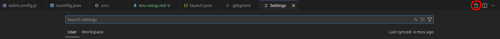

# Настройка окружния для разработки

## Перед началом надо установить

1. [Node.js](https://nodejs.org/en/download)
2. [Yarn](https://yarnpkg.com/getting-started/install)
3. [Docker Desktop](https://www.docker.com/products/docker-desktop/)
4. [Visual Studio Code](https://code.visualstudio.com/)
5. ESlint (```npm install -g eslint```)

## Далее установить расширения в Visual Studio Code

1. Docker
2. Container Tool
3. DotENV
4. ESLint
5. Path Intellisense
6. Prettier - Code formatter
7. Prettier ESLint

После надо зайти в настройки, нажать на кнопку "показать как json"  и дописать строки 
```json
"eslint.lintTask.enable": true,
"editor.codeActionsOnSave": {
    "source.fixAll.eslint": "always"
},
"eslint.validate": [
    "javascript",
    "typescript",
],
```

Клонируем свой форк с гитхаба (<span style="color: red">НЕ ВСЕ ФОРК ИЛЬИ КЛОНИРУЮТ, А КАЖДЫЙ СВОЙ</span>), пропиываем в консоль ```yarn install``` и создаем файл ```.env``` и ```docker-compose.local.yml``` и копируем следущее

```env
# .env

# Portainer Configuration
PORTAINER_URL=https://your-portainer-instance
PORTAINER_API_KEY=your-portainer-api-key
PORTAINER_STACK_ID=your-stack-id
PORTAINER_ENDPOINT_ID=your-endpoint-id

# Registry Configuration
DOCKER_REGISTRY=your-registry
DOCKER_USERNAME=your-username
DOCKER_PASSWORD=your-password

# Application Environment
JWT_SECRET=your-jwt-secret
PORT=3007
NODE_ENV=development

# DynamoDB Configuration
DYNAMODB_TABLE=support-bot-table
DYNAMODB_ENDPOINT="http://localhost:8000"
DYNAMODB_REGION=us-east-1
AWS_ACCESS_KEY_ID=""
AWS_SECRET_ACCESS_KEY=""

# MinIO Configuration
MINIO_ENDPOINT="http://localhost:9001"
MINIO_ACCESS_KEY=12345678
MINIO_SECRET_KEY=12345678
MINIO_REGION=us-east-1
MINIO_BUCKET=support-bot-files

# CI/CD Configuration
CI_COMMIT_SHA=your-commit-sha
CI_REGISTRY=your-ci-registry
CI_REGISTRY_USER=your-ci-username
CI_REGISTRY_PASSWORD=your-ci-password
```

```yml
# docker-compose.local.yml


version: '3.8'
services:
  minio-local:
    image: minio/minio:latest
    ports:
      - "9000:9000"
      - "9001:9001"
    environment:
      - MINIO_ROOT_USER=${MINIO_ACCESS_KEY}
      - MINIO_ROOT_PASSWORD=${MINIO_SECRET_KEY}
    command: >
      server /data --console-address ":9001"
    volumes:
      - <local_path>/support-bot/minio-data:/data
    env_file:
      - .env


  dynamodb-local:
    command: "-jar DynamoDBLocal.jar -sharedDb -dbPath ./data"
    image: "amazon/dynamodb-local:latest"
    container_name: dynamodb-local
    ports:
      - "8000:8000"
    volumes:
      - "<local_path>/support-bot:/home/dynamodblocal/data"
    working_dir: /home/dynamodblocal
    env_file:
      - .env
```

```<local_path>``` меняйте на полный путь к папке, где будут храниться данные DynamoDB и MinIO

## Как всем этим пользоваться 

Файл ```docker-compose.local.yml``` нужен для локального запуска MinIO и DynamoDB. Заходите в него и над строчкой ```services:``` есть кнопка ```Run all services```. Тыкайте на нее и заходите во вкладку Containers слева. Если все заработало правильно, то должен появиться контейнер ```support_bot_ist``` и внтри него запущены minio и dynamodb.

При нажати на конпку Run and Debug (там же слева) появиться вкладка для запуска проекта (запускаете только через нее, так как там работает автообновление проекта при изменении файлов и отладчик при запуске через F5)
